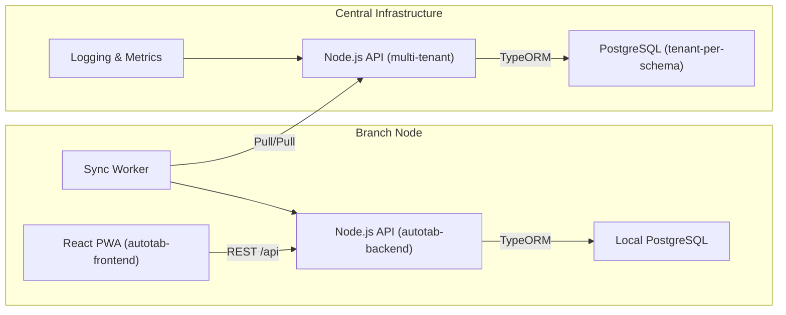
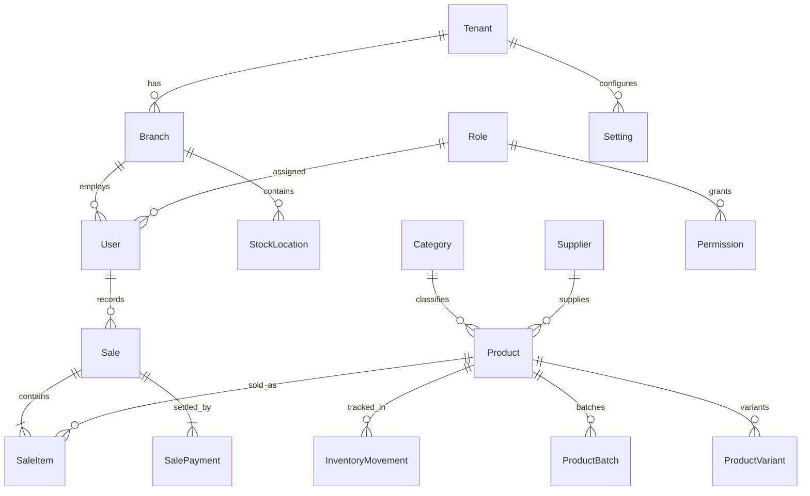

## Autotab Architecture

Autotab is an offline-first point-of-sale (POS) and inventory management platform that runs across desktop-class browsers (PWA) or can be packaged into Electron. Every branch of a business operates a local Autotab stack (PostgreSQL + API + PWA), keeps working offline, and synchronises with a central cloud deployment when connectivity returns.

### High-Level Components

- **Frontend (PWA)** — React + TypeScript with React Query & Redux Toolkit for state, Tailwind CSS for styling, and Workbox for offline caching.
- **Backend API** — Node.js (Express + TypeORM) serving POS, inventory, reporting, authentication, sync, and admin endpoints.
- **Local PostgreSQL** — Stores transactional data with tenant/branch scoping, `sync_state` metadata, and audit logs.
- **Sync Worker** — Background Node.js process polling local changes and central updates.
- **Central Backend** — Multi-tenant deployment of the same API backed by a central Postgres cluster (tenants isolated via schema or tenant id).

### Data Model Overview

Key patterns:
- **Tenant Scoped Entities** carry `tenant_id`, `branch_id`, `sync_state`, `sync_version`, and `origin`.
- **Soft multi-tenancy** within a single database; central deployment can separate tenants by schema if desired.
- **Auditability** through `audit_logs` capturing critical actions.

### Offline-First Sync Workflow

1. **Local Write** — When a cashier performs an action (sale, product update), the API writes to local Postgres and marks rows `sync_state='pending'`.
2. **Sync Worker Push** — The sync worker batches pending rows per table and POSTs them to `/api/sync/push`. The central API merges using `updated_at`/`record_version` (last-write-wins) and returns counts, flagging conflicts.
3. **Sync Worker Pull** — The worker fetches `/api/sync/pull?since=<timestamp>` to receive central changes and upserts them locally. Pull timestamps are saved in `sync_logs`.
4. **Conflict Resolution** — By default, the newer `updated_at` wins. Conflicting rows are logged with status `conflict` for later review.
5. **PWA Awareness** — The PWA shows offline status and queues UI actions even when the API is unreachable; once the API becomes available it retries.

### Security Model

- **JWT Authentication** with access + refresh tokens. Tokens embed tenant, branch, roles, and permissions.
- **Role-Based Access Control**: roles/permissions persisted in Postgres, with middleware enforcing module-level permissions.
- **Per-tenant Isolation**: every query is tenant scoped via `tenant_id` in middleware.
- **Transport Security**: Sync worker and PWA communicate with central services over HTTPS; API tokens protect sync channels.

### Deployment Topology

- **Branch Node** can be Docker Compose (local Postgres + API + sync worker + nginx for PWA) on Windows/macOS/Linux.
- **Central Node** runs behind a load balancer with Postgres HA. Multi-tenancy managed via schema per tenant or tenant id column filters.
- **Monitoring**: structured logs via Winston; hooks available for Prometheus/Grafana integration.

### Extensibility

- New modules follow the `modules/<feature>` convention (controller, service, schema, routes).
- TypeORM migrations manage schema evolution (`src/database/migrations`).
- Sync worker table list lives in `syncTables.ts` for straightforward augmentation.
- PWA uses React Query for cacheable fetches — easy to extend with custom hooks.
